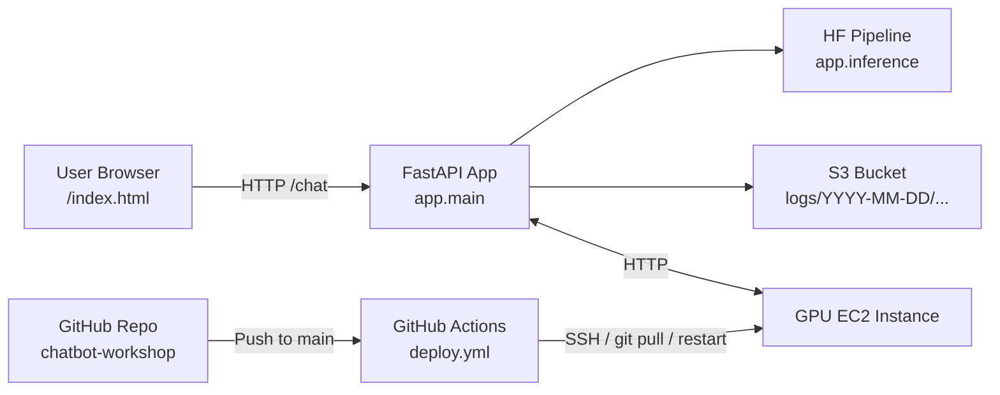
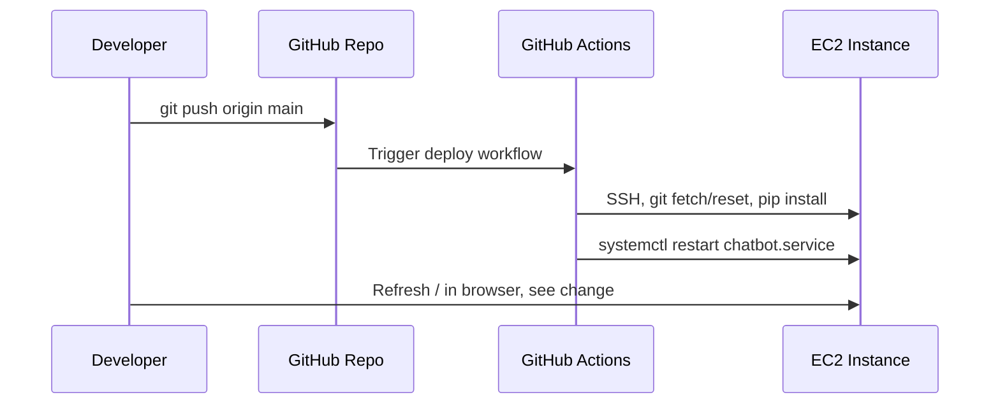

# Chatbot Workshop – FastAPI + Hugging Face + AWS EC2

This repo is a **walking skeleton** for a hands-on workshop at ASI.

Goal: show how to take a simple **LLM chatbot** in a GitHub repo and:

- Run it **locally** with FastAPI  
- Deploy it to a **GPU EC2 instance**  
- Log conversations to **S3**  
- Monitor via **logs/metrics** (CloudWatch / systemd)  
- Redeploy via **GitHub Actions → EC2**

The stack is intentionally minimal:

- **Backend**: FastAPI app (`app/`)  
- **Inference**: Hugging Face open-source chat model on GPU EC2  
- **Frontend**: very simple HTML/JS chat UI (`frontend/`) served by FastAPI  
- **Storage**: S3 bucket for conversation logs  
- **CI/CD**: GitHub Actions deploys to EC2 via SSH + `systemd` restart  

---

## Architecture



---

## Repo Layout

```text
chatbot-workshop/
├─ app/
│  ├─ __init__.py
│  ├─ main.py            # FastAPI app + routes
│  ├─ inference.py       # HF model loading + generation
│  └─ logging_utils.py   # S3 conversation logging
├─ frontend/
│  ├─ index.html         # Simple chat UI
│  └─ style.css          # Minimal styling
├─ .github/
│  └─ workflows/
│     └─ deploy.yml      # GitHub Actions → EC2 deploy
├─ .env.example          # Example environment variables
├─ requirements.txt
├─ .gitignore
└─ README.md
```

---

## Lab Flow (for the working session)

### Learning Objectives

By the end of the workshop you will be able to:

1. Run a FastAPI + Hugging Face chatbot **locally**.
2. Understand how it logs to **S3**.
3. Hit the **EC2** deployment and inspect logs.
4. Trigger a **GitHub Actions** deploy to EC2 and see your change live.

> **Note:** The facilitator pre-provisions EC2 (GPU, IAM, S3, systemd, GH secrets).

---

### Part 1 – Run the chatbot locally

1. **Clone & set up venv**

   ```bash
   git clone <REPO_URL> chatbot-workshop
   cd chatbot-workshop

   python3 -m venv .venv
   source .venv/bin/activate

   pip install --upgrade pip
   pip install -r requirements.txt
   ```

2. **Run the app**

   ```bash
   uvicorn app.main:app --host 0.0.0.0 --port 8080
   ```

3. **Test in browser**

   - Go to `http://localhost:8000`
   - Ask a few questions
   - Watch logs in the terminal

✅ **Checkpoint:** Chatbot works locally.

---

### Part 2 – Quick code walkthrough

Look at:

- `app/main.py`
  - `GET /` serves `frontend/index.html`
  - `POST /chat` → calls `generate_reply()` and `log_interaction()`
- `app/inference.py`
  - Lazy-loads the HF model via `get_generator()`
  - Builds a simple `User / Assistant` prompt
- `app/logging_utils.py`
  - Writes each interaction as a JSON file to S3:
    - `logs/YYYY-MM-DD/<session_id>/<uuid>.json`
- `frontend/index.html`
  - Minimal JS chat UI posting to `/chat`

---

### Part 3 – View logs in S3 (facilitator demo)

The facilitator will:

- Open the S3 bucket in AWS console  
- Navigate to `logs/<today>/<session_id>/...`  
- Open one JSON and show the stored interaction

---

### Part 4 – EC2 deployment

The facilitator has already deployed this repo to a GPU EC2 instance and wired `systemd`.

1. Visit: `http://<EC2_PUBLIC_IP>:8080` (provided in session)
2. Ask questions → confirm it behaves like local
3. Facilitator shows:
   - `journalctl -u chatbot.service` on EC2
   - New log files in S3 for EC2 traffic

---

### Part 5 – CI/CD with GitHub Actions

**Workflow:** `.github/workflows/deploy.yml`



**Hands-on:**

1. Edit `frontend/index.html` and change the `<h1>` title
2. Commit & push:

   ```bash
   git commit -am "Change chatbot title"
   git push origin main
   ```

3. Watch the `Deploy to EC2` workflow in the **Actions** tab
4. Refresh the EC2 URL and confirm the new title

✅ **Checkpoint:** You’ve seen repo → push → CI → EC2 → visible change.

---

## AWS Deployment Details (for facilitator)

### EC2 Environment (one-time setup)

On the EC2 instance (GPU) as root and/or `chatbot` user:

```bash
# One-time
sudo adduser chatbot
sudo mkdir -p /opt/chatbot-workshop
sudo chown -R chatbot:chatbot /opt/chatbot-workshop
```

```bash
# Get uv for x10 package install speed
curl -LsSf https://astral.sh/uv/install.sh | sh
```

```bash
ssh-keygen -t ed25519 -C "ec2-github"
cat ~/.ssh/id_ed25519.pub
```
Generate SSH keypair on EC2
1. Go to GitHub → Settings → SSH and GPG keys
2. Click New SSH key
3. Paste your EC2 public key.

```bash
cd /opt
python3 -m venv chatbot-venv
source chatbot-venv/bin/activate

# As chatbot user
cd /opt/chatbot-workshop
git clone <REPO_URL> .
uv pip install -r requirements.txt
cp .env.example .env   # then edit .env with S3_BUCKET_NAME, etc.
```

### Example `systemd` unit (`/etc/systemd/system/chatbot.service`)

```ini
[Unit]
Description=Workshop Chatbot FastAPI Service
After=network.target

[Service]
User=chatbot
Group=chatbot
WorkingDirectory=/opt/chatbot-workshop
EnvironmentFile=/opt/chatbot-workshop/.env
ExecStart=/opt/chatbot-venv/bin/uvicorn app.main:app --host 0.0.0.0 --port 8080
Restart=always
RestartSec=5

[Install]
WantedBy=multi-user.target
```

Enable & start:

```bash
sudo systemctl daemon-reload
sudo systemctl enable chatbot.service
sudo systemctl start chatbot.service
```

---

## GitHub Actions Deployment

Workflow: `.github/workflows/deploy.yml`

- Triggers on `push` to `main`
- Uses an SSH key (`EC2_SSH_KEY`) and host (`EC2_HOST`) from repo secrets
- On EC2: `git fetch/reset`, `pip install -r requirements.txt`, `systemctl restart chatbot.service`

You can extend this later with tests, health checks, blue/green, etc.

---

## Configuration

Environment variables (`.env`):

```bash
S3_BUCKET_NAME=your-chatbot-logs-bucket
MODEL_ID=TinyLlama/TinyLlama-1.1B-Chat-v1.0
APP_VERSION=workshop-1
HF_TOKEN=
```

The EC2 instance must have an IAM role with `s3:PutObject` to that bucket.

---

## Next Steps / Extensions

- Swap to a different open-source chat model  
- Introduce CloudWatch Agent for richer logs/metrics  
- Refactor into separate frontend/backend repos + CloudFront  
- Wrap infra in Terraform for reproducible environments